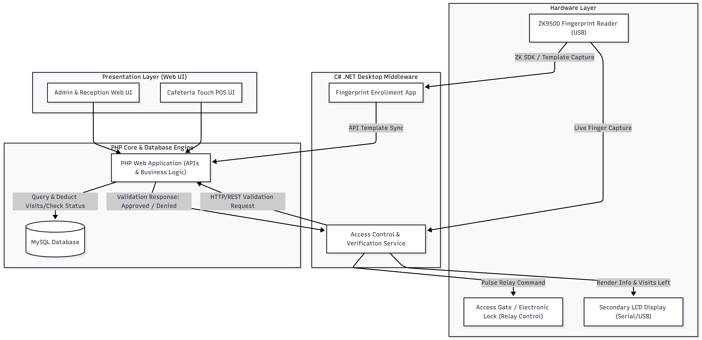

<div align="center">

# 🏋️ Easy Life Pro - Enterprise Gym & Access Control Platform
### Integrated Gym Management System, ZKTeco Biometric Control & Touch POS

[](https://xsportnablus.com/)
[](https://www.php.net/)
[](https://dotnet.microsoft.com/)
[](#)
[](https://www.mysql.com/)

*A commercial-grade, multi-layered management platform deployed across sports facilities and health clubs. Combines a central PHP web engine with low-level C# .NET services for sub-second ZKTeco fingerprint verification, automated turnstile/door relays, secondary LCD display rendering, and an integrated touchscreen cafeteria POS.*

</div>

---

## 📖 System Overview

**Easy Life Pro** is an end-to-end operational and financial management ecosystem engineered for commercial gyms and athletic academies. The system bridges web-based management workflows with physical hardware controllers, automating biometric member verification, visit-based subscription passes ("Dukhoolyaat"), door relay access control, touchscreen point of sale transactions, and financial reporting.

* **Production Live Portal:** [https://xsportnablus.com/](https://xsportnablus.com/)
* **Project Type:** Closed-Source Commercial Architecture Case Study.

---

## 🏛️ System Architecture

The application implements a hybrid architectural model: a central PHP application handles business logic and transactional data storage, while lightweight C# .NET desktop background services manage local hardware devices (ZK9500 scanners, door relays, and external secondary LCD displays).

<p align="center">
  
</p>

```mermaid
flowchart TB
    subgraph Hardware["Hardware Peripherals"]
        ZK["ZK9500 Fingerprint Reader (USB)"]
        Gate["Door Lock / Turnstile Relay Control"]
        LCD["Secondary LCD Customer Display (Serial/USB)"]
    end

    subgraph Desktop["C# .NET Desktop Middleware"]
        GateService["Access Control Verification Service"]
    end

    subgraph Backend["Core Web Engine & Database"]
        PHP["PHP Web Application (APIs & Logic)"]
        DB[("MySQL Database")]
    end

    ZK -->|Live Template Capture| GateService
    GateService -->|HTTP/REST Verification Request| PHP
    PHP <--> DB
    PHP -->|Validation Response: Approved / Denied| GateService
    GateService -->|Pulse Electric Lock Signal| Gate
    GateService -->|Render Status & Remaining Visits| LCD