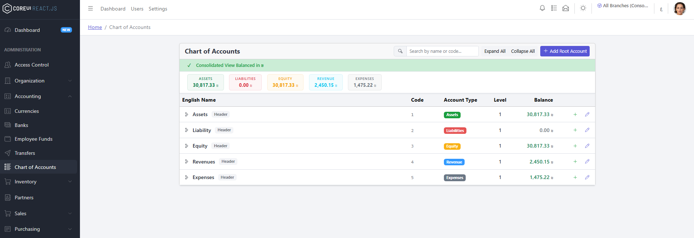
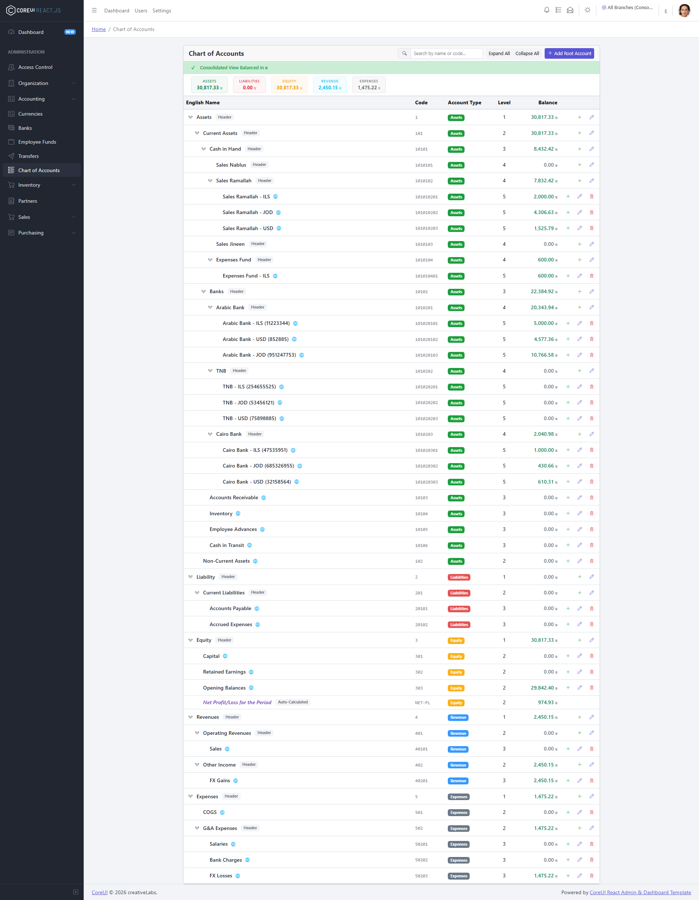
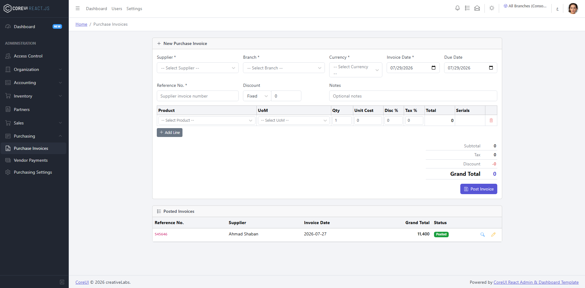
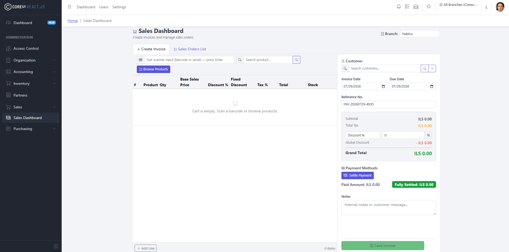
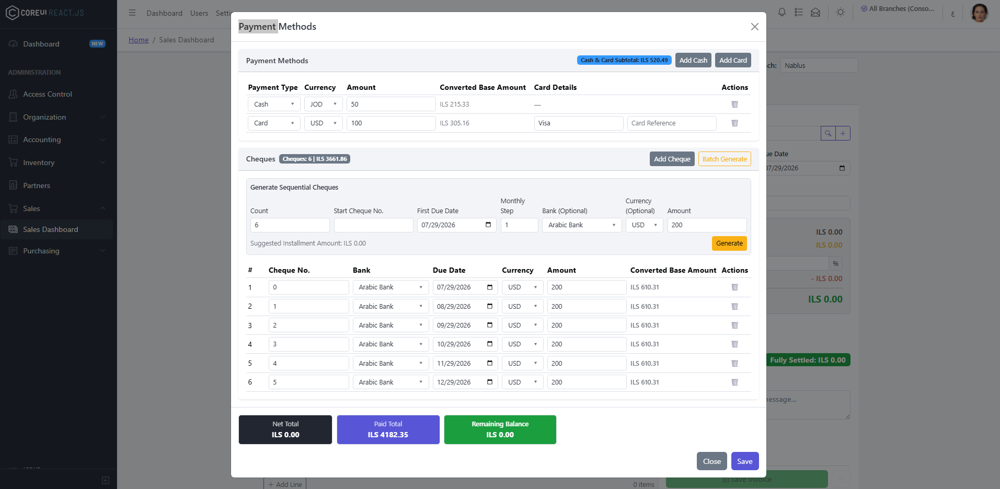
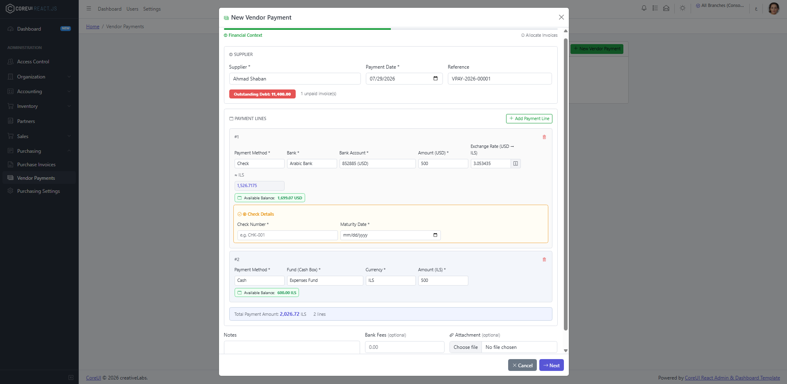
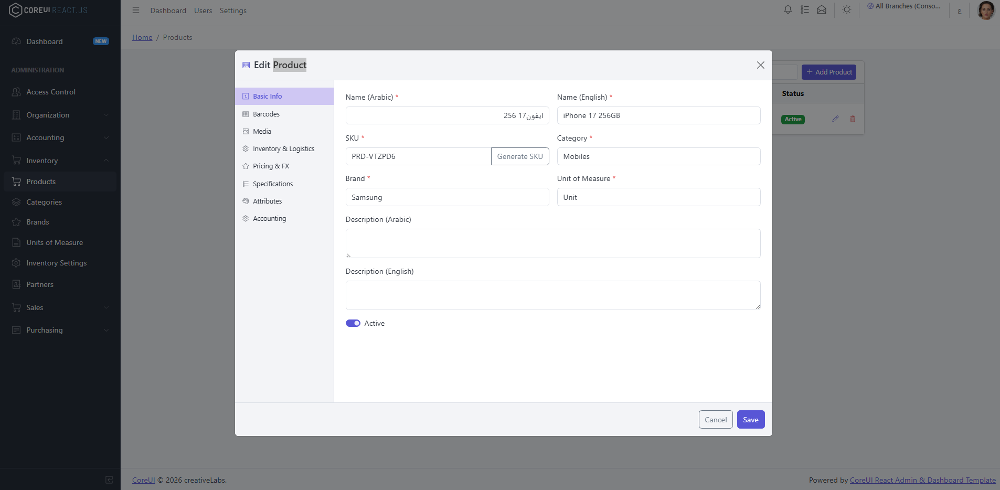
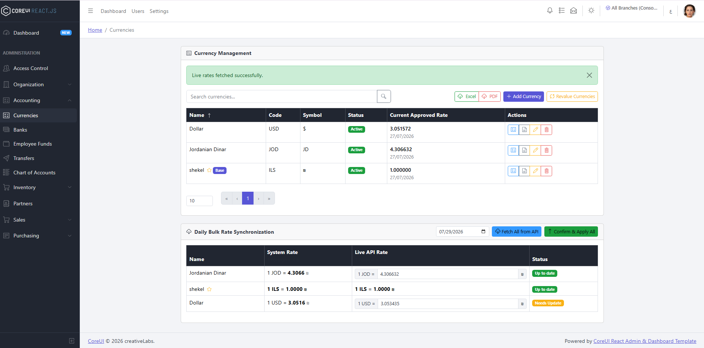
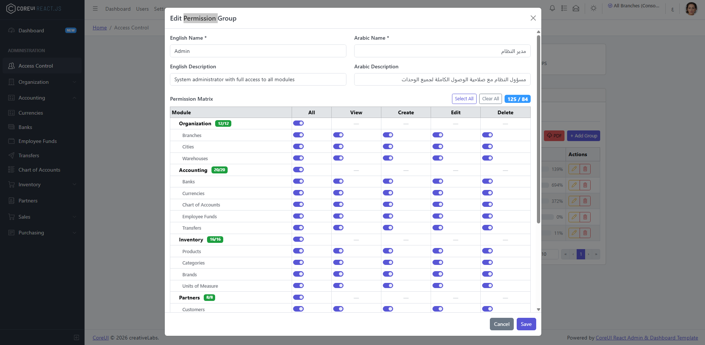

# 🏢 Commerce ERP & E-Commerce Platform
### Enterprise Modular Monolith Architecture Case Study

*A production-grade, multi-tenant enterprise ERP and e-commerce backend platform engineered with .NET 10, Clean/Onion Architecture principles, and a modular monolith structure.*

---

## 📖 Overview

**Commerce ERP** is a robust, scalable enterprise-grade resource planning system designed to manage complex business operations including Multi-currency General Ledger (Accounting), Inventory Control, Purchasing, Sales, Partner Relationships, and Multi-tenant Branch management.

This repository serves as an **Architecture & Engineering Case Study** highlighting the backend design patterns, security layers, data isolation strategies, and modular structure implemented without exposing proprietary business logic.

---

## 🏛️ System Architecture

The solution follows a strict **Modular Monolith** structure per bounded context, separating concerns across Presentation, Application, Domain, and Infrastructure layers while sharing a single physical SQL Server database through isolated EF Core contexts.

  

### Bounded Context Modules

| Module | Core Responsibility | Persistence & Layers |
|--------|---------------------|----------------------|
| **Tenancy** | Multi-tenant company configuration | `TenancyDbContext` |
| **Identity** | Users, Roles, JWT, Granular RBAC Permissions | `IdentityModuleDbContext` |
| **Organization** | Branches, Cities, Warehouses & Context Service | `OrganizationDbContext` |
| **Accounting** | Chart of Accounts (COA), GL, FX Rates, Funds | `AccountingDbContext` |
| **Inventory** | Products, Categories, Brands, UOM conversions | `InventoryDbContext` |
| **Partners** | Customers & Suppliers dual-role management | `PartnersDbContext` |
| **Purchasing** | Purchase invoices, payments, vouchers, reconciliation | `PurchasingDbContext` |

---

## 🖥️ UI & Interface Showcase

Here are snapshots showcasing the React Admin Dashboard and functional modules of the ERP system:

### 1. Main Dashboard & KPI Analytics

  

*Overview of the administrative dashboard providing high-level KPIs, branch tracking, and responsive layout.*

---

### 2. Chart of Accounts (COA) Tree Engine

  

  

*Hierarchical tree implementation supporting parent-child account nodes, leaf tracking, and automated balance aggregation.*

---

### 3. Purchasing & Sales Operations

  <table>
    <tr>
      <td width="50%" align="center"><b>Purchasing Module</b></td>
      <td width="50%" align="center"><b>Sales Module</b></td>
    </tr>
    <tr>
      <td></td>
      <td></td>
    </tr>
  </table>

*Manage procurement cycles, vendor purchase orders, and sales distribution pipelines seamlessly.*

---

### 4. Financial Transactions & Payments

  <table>
    <tr>
      <td width="50%" align="center"><b>General Payment Voucher</b></td>
      <td width="50%" align="center"><b>Vendor Payment Settlement</b></td>
    </tr>
    <tr>
      <td></td>
      <td></td>
    </tr>
  </table>

*Double-entry accounting transaction handling with multi-currency support and automated ledger postings.*

---

### 5. Product Catalog & Currency Exchange

  <table>
    <tr>
      <td width="50%" align="center"><b>Product Management</b></td>
      <td width="50%" align="center"><b>Multi-Currency & FX Rates</b></td>
    </tr>
    <tr>
      <td></td>
      <td></td>
    </tr>
  </table>

*Comprehensive product categorization with UOM configurations, alongside real-time foreign currency exchange rate handling.*

---

## 🔒 Security & Access Control

### Granular RBAC Permissions

  

*Dynamic permission-based authorization engine utilizing hierarchical reflection over module constants, enforced via custom middleware.*

- **Authentication:** ASP.NET Core Identity + JWT Bearer tokens with custom claims (`TenantId`, `BranchId`, permissions).
- **Branch Isolation:** `X-Branch-Id` HTTP header processed by `BranchAccessMiddleware` and injected via `IBranchContextService` to apply automatic EF Core query filters.
- **Active User Validation:** `ActiveUserMiddleware` intercepts requests to instantly revoke stale JWT tokens if a user account is deactivated.

---

## 🛠️ Key Technical Highlights

1. **Modular .NET 10 Architecture:** Clean separation of concerns with domain models isolated from infrastructure.
2. **Generic Repository & Per-Context Unit of Work:** Each bounded context manages its own transactional boundaries via dedicated `UnitOfWork` instances over 7 modular `DbContexts`.
3. **Compile-Time Safe Mappings:** Zero AutoMapper runtime overhead; custom static extension methods handle DTO mapping explicitly for maximum performance and debug transparency.
4. **FluentValidation Integration:** Robust asynchronous request validation with localized error handling (Arabic & English support).

---

## 👨‍💻 Author

**Motei Shaban**
- Software Engineer & M.Sc. AI/ML Student @ Blekinge Institute of Technology (BTH)
- Expertise: Enterprise Systems, .NET Core, Clean Architecture, Deep Learning

---