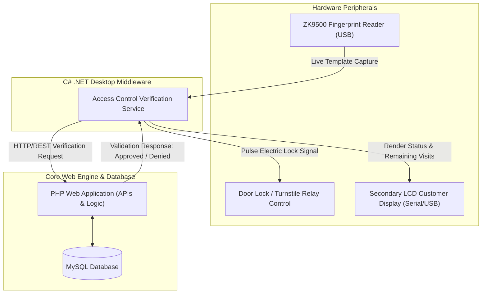
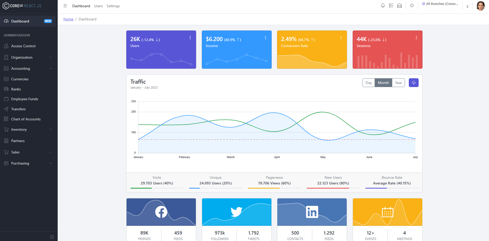
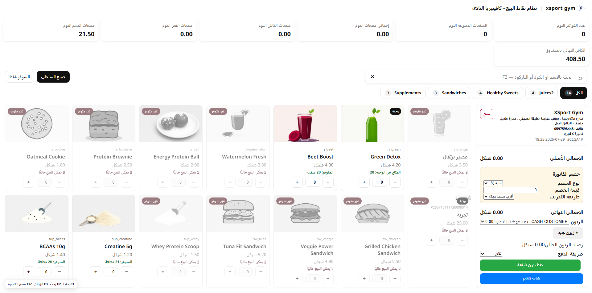
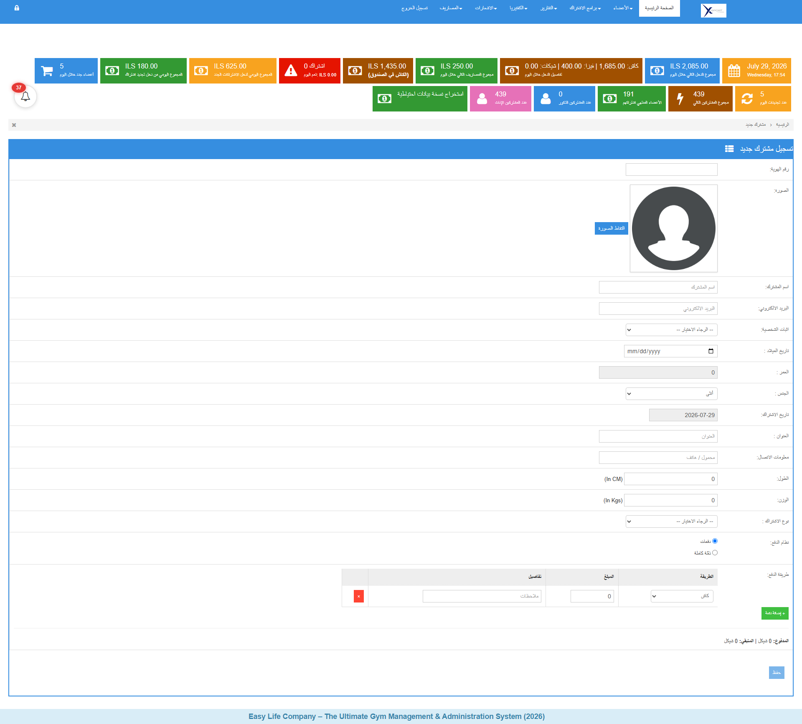
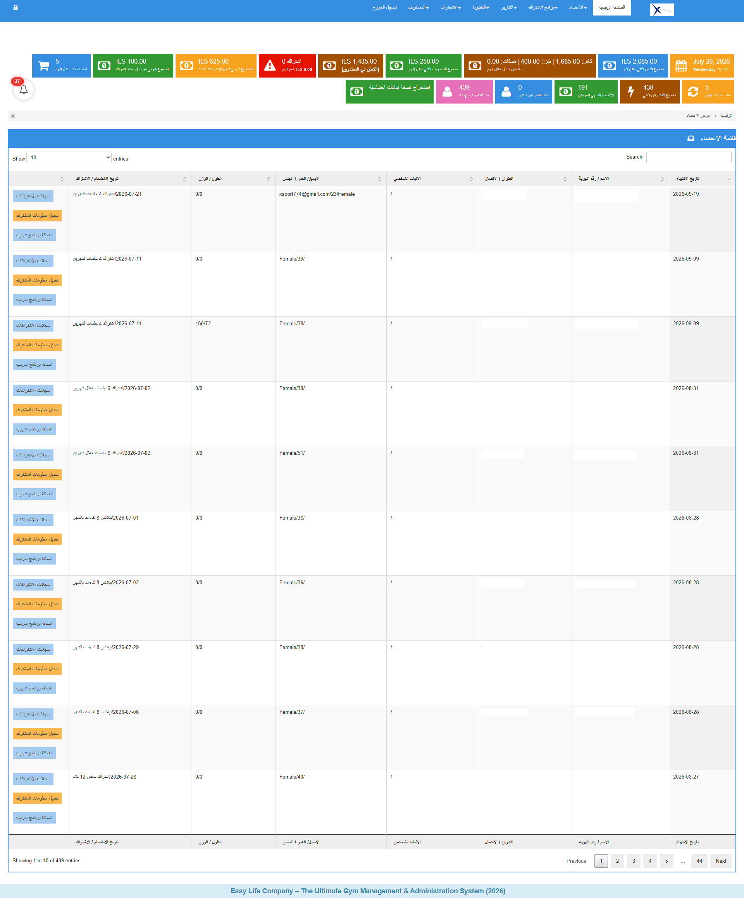
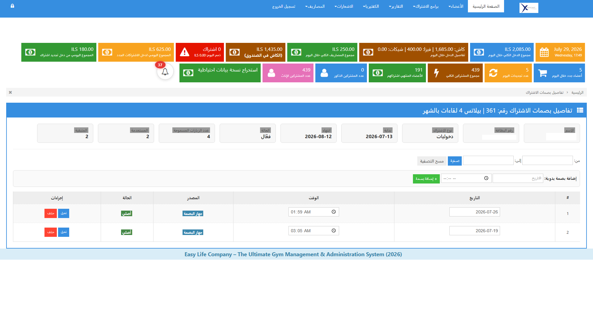
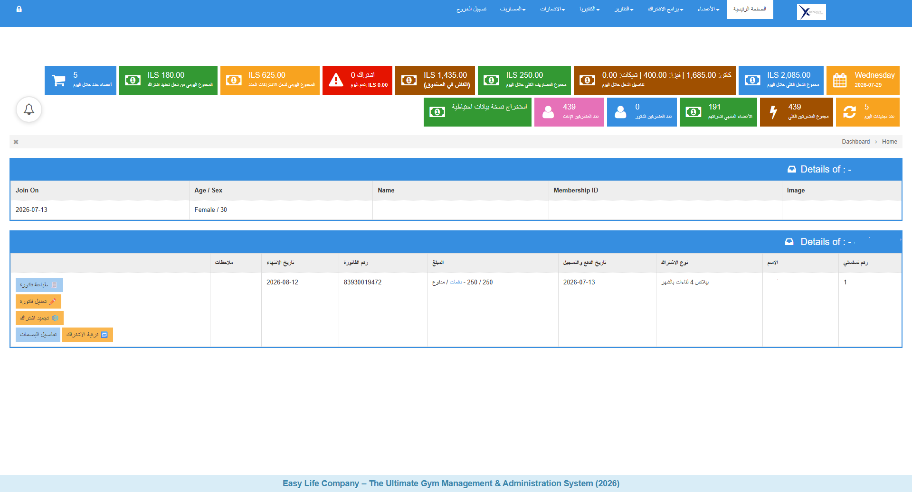
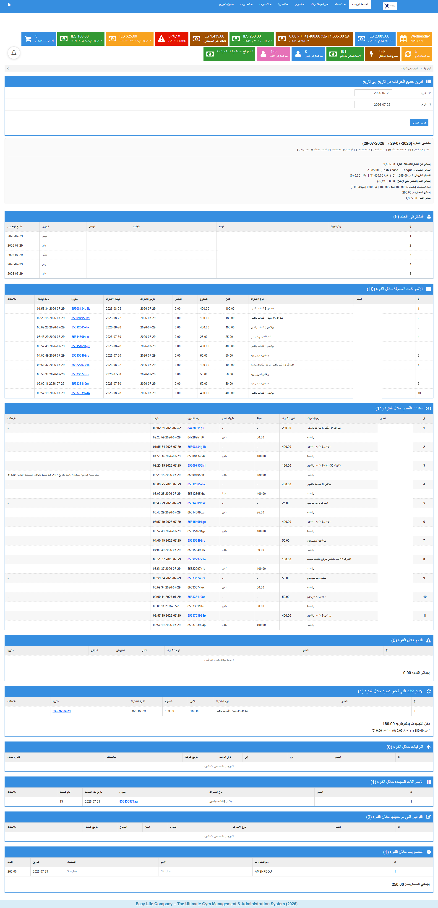

# 🏋️ Easy Life Pro - Enterprise Gym & Access Control Platform
### Integrated Gym Management System, ZKTeco Biometric Control & Touch POS

*A commercial-grade, multi-layered management platform deployed across commercial fitness centers and sports academies. Combines a central PHP web engine with low-level C# .NET desktop services for sub-second ZKTeco fingerprint verification, automated turnstile gate relays, secondary LCD customer display rendering, and an integrated touchscreen cafeteria POS.*

---

## 📖 System Overview

**Easy Life Pro** is an end-to-end operational and financial management ecosystem engineered for commercial gyms and athletic academies. The system bridges web administrative workflows with physical hardware controllers, automating biometric member verification, visit-based subscription passes ("Dukhoolyaat"), door relay access control, touchscreen point of sale transactions, and financial auditing.

* **Production Live Portal:** [https://xsportnablus.com/](https://xsportnablus.com/)
* **Project Type:** Closed-Source Commercial Architecture Case Study.

---

## 🏛️ System Architecture

The application implements a hybrid architectural pattern: a central PHP application handles core business logic and database persistence, while lightweight C# .NET desktop background services interface directly with local hardware devices (ZK9500 fingerprint scanners, door relays, and external LCD customer displays).

  

---

## 🎥 Real-World Hardware Integration Demos

Live field deployment execution demonstrating low-level C# middleware interfacing with ZKTeco biometric readers, secondary display monitors, and electronic door locks.

### 1. Reception Desk Scan & Customer LCD Display
*Member scans fingerprint at reception. The secondary desk monitor immediately renders member profile photo, full name, subscription expiration date, active status, and remaining session count.*

  

---

### 2. Biometric Door Lock & Relay Access Control
*Member scans fingerprint at facility entry point. Upon verification, the C# middleware sends a signal pulse to trigger the electric door relay, unlatching access instantly.*

  

---

### 3. Biometric Verification & Visual Feedback
*Real-time access validation logic: Instant green success screen for valid members vs. red warning modal for expired subscriptions or unregistered fingerprints.*

  

---

## 🌐 Public Web Portal & Branding

Integrated public web landing portal for client branding, session scheduling, and facility showcases.

  

---

## 🖥️ System Modules & Interface Showcase

### 1. Executive Dashboard & Real-Time Analytics
Central command view displaying financial aggregates, daily income distributions split by payment method (Cash, Credit Card, Cheques), gender distribution ratios, active vs. expired member metrics, and system alert indicators.

  

---

### 2. Touchscreen Cafeteria POS System
Fully integrated Point of Sale (POS) module designed for gym cafeterias and protein bars. Supports visual category browsing (Supplements, Sandwiches, Healthy Sweets, Juices), fast barcode lookup, stock alerts, custom discounts, split payments, and thermal receipt printing.

  

---

### 3. Member Registration & Onboarding
Detailed registration form capturing personal identification, live camera profile photo, age calculation, physical metrics (height/weight), medical history, and immediate invoice generation.

  

---

### 4. Member Directory & Status Monitoring
Searchable directory enabling staff to filter members by name, national ID, phone number, or join date, update records, and assign workout programs.

  

---

### 5. Biometric Visit Pass Log ("Dukhoolyaat")
Dedicated tracking interface for visit-counted pass subscriptions (e.g., 10 or 20 visit passes). Monitors total allocated visits, used entries, remaining sessions, access timestamps, and manual overrides.

  

---

### 6. Individual Member Financial Ledger
Granular account overview displaying itemized payment histories, outstanding balances, active contract terms, invoice re-printing, and membership freezing options.

  

---

### 7. Dynamic Membership Plan Management
Administrative portal for defining custom subscription terms (Monthly, Bi-Monthly, Annual), activity-based visit quotas, standard rates, and active promotional discounts.

  

---

### 8. Financial Audit & Revenue Reporting
Comprehensive period-based financial audit reporting tool summarizing net daily revenue, expense transactions, new member registrations, renewals, deferred debts, and net balance summaries.

  

---

## 🛠️ Key Technical Highlights

1. **Sub-Second Biometric Interfacing:** C# desktop middleware intercepts native ZK9500 SDK events, validates against the PHP REST API, and triggers electric door relays in under 300ms.
2. **Atomic Visit Locking:** Concurrency-locked database transactions eliminate multi-tap session deduction errors during rapid scanning.
3. **Serial Display Drivers:** Multi-threaded C# processes update external LCD customer monitors asynchronously during active scans.
4. **Touch-Optimized UI:** High-contrast, responsive web UI designed for reception desks and touchscreen POS terminals.
5. **Role-Based Access Control (RBAC):** Strict security partitions dividing System Admins, Accountants, Receptionists, and POS Cashiers.

---

## 👨‍💻 Developed By

**Motei Shaban**
- Software Engineer & System Architect
- Expertise: System Architecture, Enterprise Software, Hardware Integration, C#/.NET, PHP & Clean Architecture.
